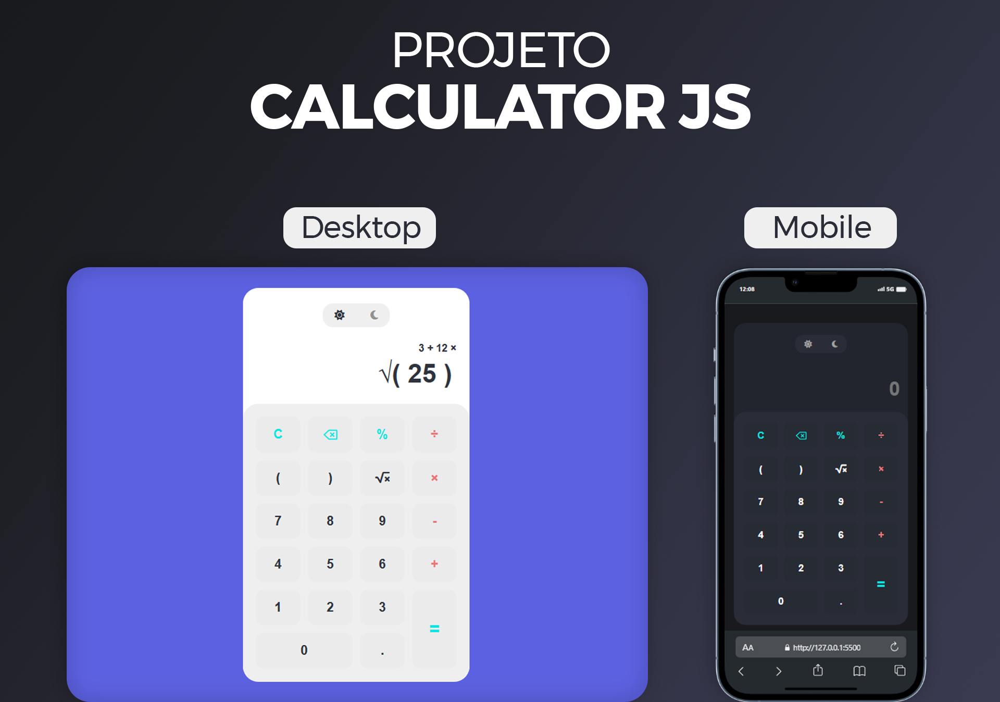

<h1 align="center">Projeto Calculator JS</h1>

  <a href="#-tecnologias">Tecnologias</a>&nbsp;&nbsp;&nbsp;|&nbsp;&nbsp;&nbsp;
  <a href="#-projeto">Projeto</a>&nbsp;&nbsp;&nbsp;|&nbsp;&nbsp;&nbsp;
  <a href="#-layout">Layout</a>

 

  

## 🚀 Tecnologias

Esse projeto foi desenvolvido com as seguintes tecnologias:

- HTML e CSS
- JavaScript
- Git e Github

## 💻 Projeto

Esta é uma calculadora que foi desenvolvida com o intuito de aplicar os conceitos sobre manipulação do DOM, aprendidos no curso da OneBitCode.
Procurei ir além da proposta do projeto, adicionando um layout diferenciado, e mais opções para o usuário realizar equações.

## 🔖 Layout

Você pode visualizar o layout usado como referência para este projeto através [DESSE LINK](<https://dribbble.com/shots/14709020-Calculator>).

## :memo: Licença

Esse é um projeto guiado do curso da OneBitCode, no qual me dei a liberdade de customizá-lo da maneira que achei melhor.
© 2024 Desenvolvido por Geovane Silva